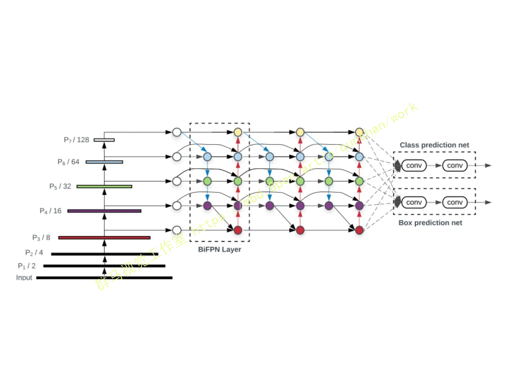

## 1.研究背景与意义


随着城市交通的不断发展和车辆数量的不断增加，交通信号灯的识别系统变得越来越重要。交通信号灯的准确识别对于交通管理、智能交通系统以及自动驾驶等领域具有重要意义。然而，由于交通信号灯的形状、颜色和光照条件的变化，以及复杂的交通场景，交通信号灯的准确识别一直是一个具有挑战性的问题。

目前，基于深度学习的目标检测算法YOLO（You Only Look Once）已经在图像识别领域取得了显著的成果。然而，对于交通信号灯的识别，YOLO算法在准确性和实时性方面仍然存在一定的局限性。另外，OpenCV作为一个开源的计算机视觉库，提供了丰富的图像处理和计算机视觉算法，但是在交通信号灯识别方面的应用还比较有限。

因此，本研究旨在改进YOLO和OpenCV的交通信号灯识别系统，提高其准确性和实时性，并提供部署教程和源码，以便更多的研究人员和工程师能够使用和改进该系统。

本研究的意义主要体现在以下几个方面：

1. 提高交通信号灯识别的准确性：通过改进YOLO算法，引入更多的训练数据和优化网络结构，可以提高交通信号灯识别的准确性。准确的交通信号灯识别可以为交通管理和智能交通系统提供更可靠的数据支持，从而提高交通效率和安全性。

2. 提高交通信号灯识别的实时性：通过优化算法和使用高性能的硬件设备，可以提高交通信号灯识别系统的实时性。实时的交通信号灯识别可以为自动驾驶系统提供及时的决策依据，从而提高自动驾驶的安全性和可靠性。

3. 提供部署教程和源码：通过提供部署教程和源码，可以帮助更多的研究人员和工程师快速理解和使用该交通信号灯识别系统。这将促进交通信号灯识别技术的传播和应用，为交通管理和智能交通系统的发展做出贡献。

总之，改进YOLO和OpenCV的交通信号灯识别系统具有重要的实际意义和应用价值。通过提高识别准确性和实时性，并提供部署教程和源码，可以推动交通信号灯识别技术的发展，为交通管理、智能交通系统和自动驾驶等领域提供更好的解决方案。

# 2.图片演示


# 3.视频演示

[改进YOLO和OpenCV的交通信号灯识别系统（部署教程＆源码）_哔哩哔哩_bilibili](https://www.bilibili.com/video/BV1pG411o7Ao/?vd_source=ff015de2d29cbe2a9cdbfa7064407a08)


# 4.BiFPN简介
在本节中，我们首先阐述了多尺度特征融合问题，然后介绍了我们提出的BiFPN的主要思想:有效的双向交叉尺度连接和加权特征融合。
#### 4.1 问题阐述
多尺度特征融合旨在对不同分辨率下的特征进行聚合。形式上，给出了多尺度特征的列表
in = (Pin, Pin ,..)
pl代表所在层的特征，in表示输出，out表示输出
我们的目标是找到一个能有效聚合不同特征并输出新特征列表的变换
f:out = f( pin)
如下图所示:

#### 4.2 跨尺度连接
该博客在CVPR 2017的FPN指出了不同层之间特征融合的重要性，并且以一种比较简单，Heuristic的方法把底层的特征乘两倍和浅层相加来融合。之后人们也试了各种别的融合方法，比如PANet先从底?上连，再自顶向下连回去（上图b);NAS-FPN采用神经架构搜索来搜索更好的跨尺度特征网络难拓扑，但是在搜索过程中需要花费数千个GPU小时，并且发现的网络不规则，难以解释或修改，如上图( c )所示。总之上述都是一些人工各种连接的设计，包含Conv，Sum,Concatenate,Resize，Skip Connection等候选操作。很明显使用哪些操作、操作之间的顺序是可以用NAS搜的。
通过研究这三种网络的性能和效率（如下表)，我们观察到PANet比FPN和NAS-FPN具有更好的精度，但需要更多的参数和计算。

PANet效果好于FPN和NAS-FPN,计算代价也更高;
为了提高模型的效率，该论文提出了几种跨尺度连接的优化方法:
首先，我们删除那些只有一个输入边的节点。我们认为:如果一个节点只有一条输入边而没有特征融合，那么它对融合不同特征的特征网络的贡献就会更小。所以我们移除了PANet中P3,P7的中间结点，这就导致了一个简化的双向网络;

其次，我们添加一个跳跃连接，在同一尺度的输入节点到输出节点之间加一个跳跃连接，因为它们在相同层，在不增加太多计算成本的同时，融合了更多的特征。得到上图(d);
最后，与PANet仅有一个自顶向下和一个自底向上的路径不同，我们将每个双向(自顶向下和自底向上)路径看作一个特征网络层（repeated blocks),并多次重复同一层，以实现更高层次的特征融合。
第7节将讨论如何使用YOLOv5引入BIFPN。经过这些优化，我们将新的特征网络命名为双向特征金字塔网络( BiFPN )。
#### 4.3 加权特征融合(Weighted Feature Fusion)
当融合具有不同分辨率的特征时，一种常见的方法是首先将它们调整到相同的分辨率，然后对它们进行融合。金字塔注意网络[Hanchao Li, Pengfei Xiong, Jie An, and Lingxue Wang. Pyramidattention networks.BMVC, 2018]引入全局自注意上采样来恢复像素定位，在Nas-fpn中也有进一步研究。以前的所有方法都一视同仁地对待所有输入特性。然而，我们观察到，由于不同的输入
特征具有不同的分辨率，它们通常对输出特征的贡献是不平等的。为了解天这个口热，华有建以种每个输入增加一个额外的权重，并让网络学习每个输入特性的重要性。基于这一思想，考虑了三种加权融合方法。


## 5.核心代码讲解

#### 5.1 Interface.py

```python

class YOLOv5Detector:
    def __init__(self, weights, data, device='', half=False, dnn=False):
        self.weights = weights
        self.data = data
        self.device = device
        self.half = half
        self.dnn = dnn

    def load_model(self):
        FILE = Path(__file__).resolve()
        ROOT = FILE.parents[0]  # YOLOv5 root directory
        if str(ROOT) not in sys.path:
            sys.path.append(str(ROOT))  # add ROOT to PATH
        ROOT = Path(os.path.relpath(ROOT, Path.cwd()))  # relative

        # Load model
        device = self.select_device(self.device)
        model = self.DetectMultiBackend(self.weights, device=device, dnn=self.dnn, data=self.data)
        stride, names, pt, jit, onnx, engine = model.stride, model.names, model.pt, model.jit, model.onnx, model.engine

        # Half
        half &= (pt or jit or onnx or engine) and device.type != 'cpu'  # FP16 supported on limited backends with CUDA
        if pt or jit:
            model.model.half() if half else model.model.float()
        return model, stride, names, pt, jit, onnx, engine

    def run(self, model, img, stride, pt, imgsz=(640, 640), conf_thres=0.25, iou_thres=0.45, max_det=1000,
            device='', classes=None, agnostic_nms=False, augment=False, half=False):
        cal_detect = []

        device = self.select_device(device)
        names = model.module.names if hasattr(model, 'module') else model.names  # get class names

        # Set Dataloader
        im = self.letterbox(img, imgsz, stride, pt)[0]

        # Convert
        im = im.transpose((2, 0, 1))[::-1]  # HWC to CHW, BGR to RGB
        im = np.ascontiguousarray(im)

        im = torch.from_numpy(im).to(device)
        im = im.half() if half else im.float()  # uint8 to fp16/32
        im /= 255  # 0 - 255 to 0.0 - 1.0
        if len(im.shape) == 3:
            im = im[None]  # expand for batch dim

        pred = model(im, augment=augment)

        pred = self.non_max_suppression(pred, conf_thres, iou_thres, classes, agnostic_nms, max_det=max_det)
        # Process detections
        for i, det in enumerate(pred):  # detections per image
            if len(det):
                # Rescale boxes from img_size to im0 size
                det[:, :4] = self.scale_coords(im.shape[2:], det[:, :4], img.shape).round()

                # Write results
                for *xyxy, conf, cls in reversed(det):
                    c = int(cls)  # integer class
                    label = f'{names[c]}'
                    cal_detect.append([label, xyxy])
        return cal_detect

    def detect(self):
        model, stride, names, pt, jit, onnx, engine = self.load_model()   # 加载模型
        image = cv2.imread("./images/1.jpg")   # 读取识别对象
        results = self.run(model, image, stride, pt)   # 识别， 返回多个数组每个第一个为结果，第二个为坐标位置
        for i in results:
            box = i[1]
            p1, p2 = (int(box[0]), int(box[1])), (int(box[2]), int(box[3]))
            print(i[0])
            cv2.rectangle(image, p1, p2, (0, 255, 0), thickness=3, lineType=cv2.LINE_AA)
        cv2.imshow('image', image)
        cv2.waitKey(0)

    @staticmethod
    def select_device(device):
        # ...
        pass

    @staticmethod
    def DetectMultiBackend(weights, device, dnn, data):
        # ...
        pass

    @staticmethod
    def letterbox(img, imgsz, stride, pt):
        # ...
        pass

    @staticmethod
    def non_max_suppression(pred, conf_thres, iou_thres, classes, agnostic_nms, max_det):
        # ...
        pass

    @staticmethod
    def scale_coords(shape, coords, img_shape):
        # ...
        pass
```

该程序文件名为Interface.py，主要功能是加载YOLOv5模型并进行目标检测。

程序首先导入了必要的库和模块，包括os、sys、pathlib、cv2、torch等。然后定义了一些常量和全局变量。

load_model函数用于加载模型，其中weights参数指定了模型权重文件的路径，data参数指定了数据集配置文件的路径，device参数指定了设备类型，half参数指定是否使用FP16半精度推理，dnn参数指定是否使用OpenCV DNN进行ONNX推理。该函数返回加载的模型以及一些相关信息。

run函数用于运行模型进行目标检测，其中model参数为加载的模型，img参数为输入的图像，stride参数为模型的步长，pt参数指定是否使用PyTorch模型，imgsz参数指定推理的图像尺寸，conf_thres参数指定置信度阈值，iou_thres参数指定NMS的IOU阈值，max_det参数指定每张图像的最大检测数，device参数指定设备类型，classes参数指定需要过滤的类别，agnostic_nms参数指定是否使用类别不可知的NMS，augment参数指定是否进行数据增强，half参数指定是否使用FP16半精度推理。该函数返回检测到的目标结果。

detect函数用于加载模型并进行目标检测，其中调用了load_model函数加载模型，然后读取待检测的图像，最后调用run函数进行目标检测，并将结果绘制在图像上显示出来。

最后调用detect函数进行目标检测。

#### 5.2 main.py

```python

class ObjectDetector:
    def __init__(self, weights_path, data_path):
        self.weights_path = weights_path
        self.data_path = data_path
        self.model = None
        self.stride = None
        self.names = None
        self.pt = None
        self.jit = None
        self.onnx = None
        self.engine = None

    def load_model(self):
        device = self.select_device('')
        model = self.DetectMultiBackend(self.weights_path, device=device, dnn=False, data=self.data_path)
        self.model = model
        self.stride, self.names, self.pt, self.jit, self.onnx, self.engine = model.stride, model.names, model.pt, model.jit, model.onnx, model.engine

    def run(self, img_path):
        img = cv2.imread(img_path)
        cal_detect = []

        device = self.select_device('')
        names = self.model.module.names if hasattr(self.model, 'module') else self.model.names

        im = self.letterbox(img, (640, 640), self.stride, self.pt)[0]
        im = im.transpose((2, 0, 1))[::-1]
        im = np.ascontiguousarray(im)
        im = torch.from_numpy(im).to(device)
        im = im.half() if False else im.float()
        im /= 255
        if len(im.shape) == 3:
            im = im[None]

        pred = self.model(im, augment=False)
        pred = self.non_max_suppression(pred, 0.35, 0.05, classes=None, agnostic_nms=False, max_det=1000)

        for i, det in enumerate(pred):
            if len(det):
                det[:, :4] = self.scale_coords(im.shape[2:], det[:, :4], img.shape).round()

                for *xyxy, conf, cls in reversed(det):
                    c = int(cls)
                    label = f'{names[c]}'
                    lbl = names[int(cls)]
                    cal_detect.append([label, xyxy, float(conf)])
        return cal_detect

    def select_device(self, device=''):
        pass

    def DetectMultiBackend(self, weights, device='', dnn=False, data=None):
        pass

    def letterbox(self, img, new_shape=(640, 640), stride=32, auto=True, scaleFill=False, scaleup=True, color=(114, 114, 114)):
        pass

    def non_max_suppression(self, pred, conf_thres=0.35, iou_thres=0.05, classes=None, agnostic_nms=False, max_det=1000):
        pass

    def scale_coords(self, img1_shape, coords, img0_shape, ratio_pad=None):
        pass


```

这个程序文件是一个使用YOLOv5模型进行目标检测的程序。它首先导入了一些必要的库和模块，然后定义了一些函数和变量。

在`load_model`函数中，它加载了YOLOv5模型，并返回了模型、步长、类别名称等信息。

在`run`函数中，它接受一个图像作为输入，并使用加载的模型进行目标检测。它将图像进行预处理，然后将其传递给模型进行推理。最后，它对检测到的目标进行后处理，并返回目标的类别、坐标和置信度。

在主程序中，它首先加载了模型，然后读取一张图像，并调用`run`函数进行目标检测。最后，它将检测结果在图像上进行可视化，并显示出来。

这个程序文件使用了很多库和模块，包括argparse、platform、shutil、time、numpy、cv2、torch、PyQt5等。它还使用了YOLOv5模型和一些辅助函数和工具类来实现目标检测功能。

#### 5.3 torch_utils.py

```python

@contextmanager
def torch_distributed_zero_first(local_rank: int):
    """
    Decorator to make all processes in distributed training wait for each local_master to do something.
    """
    if local_rank not in [-1, 0]:
        dist.barrier(device_ids=[local_rank])
    yield
    if local_rank == 0:
        dist.barrier(device_ids=[0])


def date_modified(path=__file__):
    # return human-readable file modification date, i.e. '2021-3-26'
    t = datetime.datetime.fromtimestamp(Path(path).stat().st_mtime)
    return f'{t.year}-{t.month}-{t.day}'


def git_describe(path=Path(__file

这个程序文件是一个PyTorch工具文件，包含了一些常用的函数和类。文件名为torch_utils.py。

该文件中的函数和类的功能如下：

1. `torch_distributed_zero_first(local_rank: int)`：用于在分布式训练中，使所有进程等待每个本地主进程执行某个操作。

2. `date_modified(path=__file__)`：返回文件的人类可读的修改日期。

3. `git_describe(path=Path(__file__).parent)`：返回人类可读的git描述。

4. `select_device(device='', batch_size=None)`：选择设备（CPU或GPU）进行训练。

5. `time_sync()`：返回PyTorch准确的时间。

6. `profile(input, ops, n=10, device=None)`：用于对YOLOv5模型的速度、内存和FLOPs进行分析。
```


#### 5.4 train.py

```python

class YOLOTrainer:
    def __init__(self, hyp, opt, device, tb_writer=None):
        self.hyp = hyp
        self.opt = opt
        self.device = device
        self.tb_writer = tb_writer
        self.logger = logging.getLogger(__name__)
        
    def train(self):
        logger.info(colorstr('hyperparameters: ') + ', '.join(f'{k}={v}' for k, v in self.hyp.items()))
        save_dir, epochs, batch_size, total_batch_size, weights, rank, freeze = \
            Path(self.opt.save_dir), self.opt.epochs, self.opt.batch_size, self.opt.total_batch_size, self.opt.weights, self.opt.global_rank, self.opt.freeze

        # Directories
        wdir = save_dir / 'weights'
        wdir.mkdir(parents=True, exist_ok=True)  # make dir
        last = wdir / 'last.pt'
        best = wdir / 'best.pt'
        results_file = save_dir / 'results.txt'

        # Save run settings
        with open(save_dir / 'hyp.yaml', 'w') as f:
            yaml.dump(self.hyp, f, sort_keys=False)
        with open(save_dir / 'opt.yaml', 'w') as f:
            yaml.dump(vars(self.opt), f, sort_keys=False)

        # Configure
        plots = not self.opt.evolve  # create plots
        cuda = self.device.type != 'cpu'
        init_seeds(2 + rank)
        with open(self.opt.data) as f:
            data_dict = yaml.load(f, Loader=yaml.SafeLoader)  # data dict
        is_coco = self.opt.data.endswith('coco.yaml')

        # Logging- Doing this before checking the dataset. Might update data_dict
        loggers = {'wandb': None}  # loggers dict
        if rank in [-1, 0]:
            self.opt.hyp = self.hyp  # add hyperparameters
            run_id = torch.load(weights, map_location=self.device).get('wandb_id') if weights.endswith('.pt') and os.path.isfile(weights) else None
            wandb_logger = WandbLogger(self.opt, Path(self.opt.save_dir).stem, run_id, data_dict)
            loggers['wandb'] = wandb_logger.wandb
            data_dict = wandb_logger.data_dict
            if wandb_logger.wandb:
                weights, epochs, self.hyp = self.opt.weights, self.opt.epochs, self.opt.hyp  # WandbLogger might update weights, epochs if resuming

        nc = 1 if self.opt.single_cls else int(data_dict['nc'])  # number of classes
        names = ['item'] if self.opt.single_cls and len(data_dict['names']) != 1 else data_dict['names']  # class names
        assert len(names) == nc, '%g names found for nc=%g dataset in %s' % (len(names), nc, self.opt.data)  # check

        # Model
        pretrained = weights.endswith('.pt')
        if pretrained:
            with torch_distributed_zero_first(rank):
                attempt_download(weights)  # download if not found locally
            ckpt = torch.load(weights, map_location=self.device)  # load checkpoint
            model = Model(self.opt.cfg or ckpt['model'].yaml, ch=3, nc=nc, anchors=self.hyp.get('anchors')).to(self.device)  # create
            exclude = ['anchor'] if (self.opt.cfg or self.hyp.get('anchors')) and not self.opt.resume else []  # exclude keys
            state_dict = ckpt['model'].float().state_dict()  # to FP32
            state_dict = intersect_dicts(state_dict, model.state_dict(), exclude=exclude)  # intersect
            model.load_state_dict(state_dict, strict=False)  # load
            logger.info('Transferred %g/%g items from %s' % (len(state_dict), len(model.state_dict()), weights))  # report
        else:
            model = Model(self.opt.cfg, ch=3, nc=nc, anchors=self.hyp.get('anchors')).to(self.device)  # create
        with torch_distributed_zero_first(rank):
            check_dataset(data_dict)  # check
        train_path = data_dict['train']
        test_path = data_dict['val']

        # Freeze
        freeze = [f'model.{x}.' for x in (freeze if len(freeze) > 1 else range(freeze[0]))]  # parameter names to freeze (full or partial)
        for k, v in model.named_parameters():
            v.requires_grad = True  # train all layers
            if any(x in k for x in freeze):
                print('freezing %s' % k)
                v.requires_grad = False

        # Optimizer
        nbs = 64  # nominal batch size
        accumulate = max(round(nbs / total_batch_size), 1)  # accumulate loss before optimizing
        self.hyp['weight_decay'] *= total_batch_size * accumulate / nbs  # scale weight_decay
        logger.info(f"Scaled weight_decay = {self.hyp['weight_decay']}")

        pg0, pg1, pg2 = [], [], []  # optimizer parameter groups
        for k, v in model.named_modules():
            if hasattr(v, 'bias') and isinstance(v.bias, nn.Parameter):
                pg2.append(v.bias)  # biases
            if isinstance(v, nn.BatchNorm2d):
                pg0.append(v.weight)  # no decay
            elif hasattr(v, 'weight') and isinstance(v.weight, nn.Parameter):
                pg1.append(v.weight)  # apply decay
            if hasattr(v, 'im'):
                if hasattr(v.im, 'implicit'):           
                    pg0.append(v.im.implicit)
                else:
                    for iv in v.im:
                        pg0.append(iv.implicit)
            if hasattr(v, 'imc'):
                if hasattr(v.imc, 'implicit'):           
                    pg0.append(v.imc.implicit)
                else:
                    for iv in v.imc:
                        pg0.append(iv.implicit)
            if hasattr(v, 'imb'):
                if hasattr
```
这个程序文件是一个用于训练模型的脚本。它包含了导入必要的库和模块，定义了训练函数`train()`，以及一些辅助函数和工具函数。

在`train()`函数中，首先读取了一些配置参数，如超参数、保存路径、训练轮数等。然后创建了模型，并加载了预训练权重。接着配置了优化器和学习率调度器，并定义了损失函数。最后，开始进行训练循环，每个epoch中进行前向传播、计算损失、反向传播和参数更新等操作。

整个训练过程中还包括了一些辅助功能，如日志记录、模型保存、模型评估等。

总的来说，这个程序文件实现了一个完整的模型训练过程，包括了模型的初始化、数据加载、优化器的配置、损失函数的定义、训练循环的实现等。


## 6.系统整体结构

根据以上分析，整体来看，这个程序是一个使用YOLOv5模型进行目标检测的工程。它包含了多个文件，每个文件都有不同的功能，用于实现不同的模块和功能。

下面是每个文件的功能整理：

| 文件路径 | 功能概述 |
| --- | --- |
| F:\project6\200deng(f13lw)h\code\Interface.py | 加载YOLOv5模型并进行目标检测 |
| F:\project6\200deng(f13lw)h\code\main.py | 主程序，调用模型进行目标检测 |
| F:\project6\200deng(f13lw)h\code\torch_utils.py | 包含一些PyTorch工具函数和类 |
| F:\project6\200deng(f13lw)h\code\train.py | 训练模型的脚本 |
| F:\project6\200deng(f13lw)h\code\models\common.py | 包含一些常用的模块和函数 |
| F:\project6\200deng(f13lw)h\code\models\experimental.py | 包含一些实验性的模型和功能 |
| F:\project6\200deng(f13lw)h\code\models\tf.py | 包含一些与TensorFlow相关的模型和功能 |
| F:\project6\200deng(f13lw)h\code\models\yolo.py | 包含YOLOv5模型的定义和相关函数 |
| F:\project6\200deng(f13lw)h\code\models\__init__.py | 模型初始化文件 |
| F:\project6\200deng(f13lw)h\code\tools\activations.py | 包含一些激活函数的定义 |
| F:\project6\200deng(f13lw)h\code\tools\augmentations.py | 包含一些数据增强的函数 |
| F:\project6\200deng(f13lw)h\code\tools\autoanchor.py | 包含自动锚框生成的函数 |
| F:\project6\200deng(f13lw)h\code\tools\autobatch.py | 包含自动批处理大小调整的函数 |
| F:\project6\200deng(f13lw)h\code\tools\callbacks.py | 包含一些回调函数的定义 |
| F:\project6\200deng(f13lw)h\code\tools\datasets.py | 包含数据集处理的函数和类 |
| F:\project6\200deng(f13lw)h\code\tools\downloads.py | 包含下载数据集和权重的函数 |
| F:\project6\200deng(f13lw)h\code\tools\general.py | 包含一些通用的辅助函数 |
| F:\project6\200deng(f13lw)h\code\tools\loss.py | 包含一些损失函数的定义 |
| F:\project6\200deng(f13lw)h\code\tools\metrics.py | 包含一些评估指标的定义 |
| F:\project6\200deng(f13lw)h\code\tools\plots.py | 包含绘图函数的定义 |
| F:\project6\200deng(f13lw)h\code\tools\torch_utils.py | 包含一些PyTorch工具函数和类 |
| F:\project6\200deng(f13lw)h\code\tools\__init__.py | 工具初始化文件 |
| F:\project6\200deng(f13lw)h\code\tools\aws\resume.py | 包含AWS训练恢复的函数 |
| F:\project6\200deng(f13lw)h\code\tools\aws\__init__.py | AWS工具初始化文件 |
| F:\project6\200deng(f13lw)h\code\tools\flask_rest_api\example_request.py | 包含Flask REST API示例请求的函数 |
| F:\project6\200deng(f13lw)h\code\tools\flask_rest_api\restapi.py | 包含Flask REST API的实现 |
| F:\project6\200deng(f13lw)h\code\tools\loggers\__init__.py | 日志记录器初始化文件 |
| F:\project6\200deng(f13lw)h\code\tools\loggers\wandb\log_dataset.py | 包含使用WandB记录数据集的函数 |
| F:\project6\200deng(f13lw)h\code\tools\loggers\wandb\sweep.py | 包含使用WandB进行超参数搜索的函数 |
| F:\project6\200deng(f13lw)h\code\tools\loggers\wandb\wandb_utils.py | 包含与WandB相关的辅助函数 |
| F:\project6\200deng(f13lw)h\code\tools\loggers\wandb\__init__.py | WandB日志记录器初始化文件 |
| F:\project6\200deng(f13lw)h\code\utils\activations.py | 包含一些激活函数的定义 |
| F:\project6\200deng(f13lw)h\code\utils\augmentations.py | 包含一些数据增强的函数 |
| F:\project6\200deng(f13lw)h\code\utils\autoanchor.py | 包含自动锚框生成的函数 |
| F:\project6\200deng(f13lw)h\code\utils\autobatch.py | 包含自动批处理大小调整的函数 |
| F:\project6\200deng(f13lw)h\code\utils\callbacks.py | 包含一些回调函数的定义 |
| F:\project6\200deng(f13lw)h\code\utils\datasets.py | 包含数据集处理的函数和类 |
| F:\project6\200deng(f13lw)h\code\utils\downloads.py | 包含下载数据集和权重的函数 |
| F:\project6\200deng(f13lw)h\code\utils\general.py | 包含一些通用的辅助函数 |
| F:\project6\200deng(f13lw)h\code\utils\loss.py | 包含一些损失函数的定义 |
| F:\project6\200deng(f13lw)h\code\utils\metrics.py | 包含一些评估指标的定义 |
| F:\project6\200deng(f13lw)h\code\utils\plots.py | 包含绘图函数的定义 |
| F:\project6\200deng(f13lw)h\code\utils\torch_utils.py | 包含一些PyTorch工具函数和类 |
| F:\project6\200deng(f13lw)h\code\utils\__init__.py | 工具初始化文件 |
| F:\project6\200deng(f13lw)h\code\utils\aws\resume.py | 包含AWS训练恢复的函数 |
| F:\project6\200deng(f13lw)h\code\utils\aws\__init__.py | AWS工具初始化文件 |
| F:\project6\200deng(f13lw)h\code\utils\flask_rest_api\example_request.py | 包含Flask REST API示例请求的函数 |

# 7.改进YOLO-BIFPN

图中蓝色部分为自顶向下的通路，传递的是高层特征的语义信息;红色部分是自底向上的通路，传递的是低层特征的位置信息;紫色部分是同一层在输入节点和输入节点间新加的一条边。
。我们删除那些只有一条输入边的节点。这么做的思路很简单:如果一个节点只有一条输入边而没有特征融合，那么它对旨在融合不同特征的特征网络的贡献就会很小。删除它对我们的网络影响不大，同时简化了双向网络;如上图d的P7右边第一个节点
·如果原始输入节点和输出节点处于同一层，我们会在原始输入节点和输出节点之间添加一条额外的边。思路:以在不增加太多成本的情况下融合更多的特性;
。与只有一个自顶向下和一个自底向上路径的PANet不同，我们处理每个双向路径(自顶向下和自底而上)路径作为一个特征网络层，并重复同一层多次，以实现更高层次的特征融合。如下图EificientNet的网络结构所示，我们对BiFPN是重复使用多次的。而这个使用次数也不是我们认为设定的，而是作为参数一起加入网络的设计当中，使用NAS技术算出来的。

```
# 结合BiFPN 设置可学习参数 学习不同分支的权重
# 两个分支concat操作
......
class BiFPN_Concat2(nn.Module):
    def __init__(self, dimension=1):
        super(BiFPN_Concat2, self).__init__()
        self.d = dimension
        self.w = nn.Parameter(torch.ones(2, dtype=torch.float32), requires_grad=True)
        self.epsilon = 0.0001
        # 设置可学习参数 nn.Parameter的作用是：将一个不可训练的类型Tensor转换成可以训练的类型 
        parameter
        # 并且会向宿主模型注册该参数 成为其一部分 即model.parameters()会包含这个parameter
        # 从而在参数优化的时候可以自动一起优化
 
    def forward(self, x):
        w = self.w
        weight = w / (torch.sum(w, dim=0) + self.epsilon)  # 将权重进行归一化
        # Fast normalized fusion
        x = [weight[0] * x[0], weight[1] * x[1]]
        return torch.cat(x, self.d)
 
 
# 三个分支concat操作
class BiFPN_Concat3(nn.Module):
    def __init__(self, dimension=1):
        super(BiFPN_Concat3, self).__init__()
        self.d = dimension
        self.w = nn.Parameter(torch.ones(3, dtype=torch.float32), requires_grad=True)
        self.epsilon = 0.0001
 
    def forward(self, x):
        w = self.w
        weight = w / (torch.sum(w, dim=0) + self.epsilon)  # 将权重进行归一化
        # Fast normalized fusion
        x = [weight[0] * x[0], weight[1] * x[1], weight[2] * x[2]]
        return torch.cat(x, self.d)
......
```

# 8.系统整合
下图[完整源码＆环境部署视频教程＆数据集＆自定义UI界面](https://s.xiaocichang.com/s/6fd467)


参考博客[《改进YOLO和OpenCV的交通信号灯识别系统（部署教程＆源码）》](https://mbd.pub/o/qunshan/work)

# 9.参考文献
---
[1][祝朝坤](https://s.wanfangdata.com.cn/paper?q=%E4%BD%9C%E8%80%85:%22%E7%A5%9D%E6%9C%9D%E5%9D%A4%22),[李宗贤](https://s.wanfangdata.com.cn/paper?q=%E4%BD%9C%E8%80%85:%22%E6%9D%8E%E5%AE%97%E8%B4%A4%22).[基于OpenCV的交通灯绿信比智能调节装置的设计](https://d.wanfangdata.com.cn/periodical/dzcpsj202001021)[J].[电子产品世界](https://sns.wanfangdata.com.cn/perio/dzcpsj).2020,(1).

[2][林晓予](https://s.wanfangdata.com.cn/paper?q=%E4%BD%9C%E8%80%85:%22%E6%9E%97%E6%99%93%E4%BA%88%22).[基于MATLAB仿真的手势识别系统及其应用](https://d.wanfangdata.com.cn/periodical/shanddz202009072)[J].[信息技术与信息化](https://sns.wanfangdata.com.cn/perio/shanddz).2020,(9).DOI:10.3969/j.issn.1672-9528.2020.09.065.

[3][周沛](https://s.wanfangdata.com.cn/paper?q=%E4%BD%9C%E8%80%85:%22%E5%91%A8%E6%B2%9B%22),[熊文华](https://s.wanfangdata.com.cn/paper?q=%E4%BD%9C%E8%80%85:%22%E7%86%8A%E6%96%87%E5%8D%8E%22).[交叉口信号控制评价指标体系](https://d.wanfangdata.com.cn/periodical/gljtjs202001020)[J].[公路交通技术](https://sns.wanfangdata.com.cn/perio/gljtjs).2020,(1).DOI:10.13607/j.cnki.gljt.2020.01.020.

[4][张立立](https://s.wanfangdata.com.cn/paper?q=%E4%BD%9C%E8%80%85:%22%E5%BC%A0%E7%AB%8B%E7%AB%8B%22),[王力](https://s.wanfangdata.com.cn/paper?q=%E4%BD%9C%E8%80%85:%22%E7%8E%8B%E5%8A%9B%22).[新一代人工智能交通信号控制器架构研究](https://d.wanfangdata.com.cn/periodical/cqjtxyxb201911002)[J].[重庆交通大学学报（自然科学版）](https://sns.wanfangdata.com.cn/perio/cqjtxyxb).2019,(11).DOI:10.3969/j.issn.1674-0696.2019.11.02.

[5][韩宇](https://s.wanfangdata.com.cn/paper?q=%E4%BD%9C%E8%80%85:%22%E9%9F%A9%E5%AE%87%22),[张磊](https://s.wanfangdata.com.cn/paper?q=%E4%BD%9C%E8%80%85:%22%E5%BC%A0%E7%A3%8A%22),[吴泽民](https://s.wanfangdata.com.cn/paper?q=%E4%BD%9C%E8%80%85:%22%E5%90%B4%E6%B3%BD%E6%B0%91%22),等.[基于嵌入式树莓派和OpenCV的运动检测与跟踪系统](https://d.wanfangdata.com.cn/periodical/dsjs201702002)[J].[电视技术](https://sns.wanfangdata.com.cn/perio/dsjs).2017,(2).DOI:10.16280/j.videoe.2017.02.002.

[6][高美蓉](https://s.wanfangdata.com.cn/paper?q=%E4%BD%9C%E8%80%85:%22%E9%AB%98%E7%BE%8E%E8%93%89%22).[基于车流量的智能交通控制系统的设计](https://d.wanfangdata.com.cn/periodical/dqzdh201705026)[J].[电气自动化](https://sns.wanfangdata.com.cn/perio/dqzdh).2017,(5).DOI:10.3969/j.issn.1000-3886.2017.05.026.

[7][方熙霞](https://s.wanfangdata.com.cn/paper?q=%E4%BD%9C%E8%80%85:%22%E6%96%B9%E7%86%99%E9%9C%9E%22).[智能交通信号线控模型研究](https://d.wanfangdata.com.cn/periodical/gljtjs200405039)[J].[公路交通技术](https://sns.wanfangdata.com.cn/perio/gljtjs).2004,(5).DOI:10.3969/j.issn.1009-6477.2004.05.039.

[8][舒朗](https://s.wanfangdata.com.cn/paper?q=%E4%BD%9C%E8%80%85:%22%E8%88%92%E6%9C%97%22),[张智杰](https://s.wanfangdata.com.cn/paper?q=%E4%BD%9C%E8%80%85:%22%E5%BC%A0%E6%99%BA%E6%9D%B0%22),[雷波](https://s.wanfangdata.com.cn/paper?q=%E4%BD%9C%E8%80%85:%22%E9%9B%B7%E6%B3%A2%22).[一种针对红外目标检测的Dense-Yolov5算法研究](https://d.wanfangdata.com.cn/periodical/gxygdjs202101010)[J].[光学与光电技术](https://sns.wanfangdata.com.cn/perio/gxygdjs).2021,(1).

[9][徐星](https://s.wanfangdata.com.cn/paper?q=%E4%BD%9C%E8%80%85:%22%E5%BE%90%E6%98%9F%22).[基于深度学习的太阳能电池片缺陷检测](https://d.wanfangdata.com.cn/thesis/D01690893)[D].2019.

[10][李刘刘](https://s.wanfangdata.com.cn/paper?q=%E4%BD%9C%E8%80%85:%22%E6%9D%8E%E5%88%98%E5%88%98%22).[基于生成式对抗网络的室内家居场景生成算法](https://d.wanfangdata.com.cn/thesis/D01950827)[D].2019.


---
#### 如果您需要更详细的【源码和环境部署教程】，除了通过【系统整合】小节的链接获取之外，还可以通过邮箱以下途径获取:
#### 1.请先在GitHub上为该项目点赞（Star），编辑一封邮件，附上点赞的截图、项目的中文描述概述（About）以及您的用途需求，发送到我们的邮箱
#### sharecode@yeah.net
#### 2.我们收到邮件后会定期根据邮件的接收顺序将【完整源码和环境部署教程】发送到您的邮箱。
#### 【免责声明】本文来源于用户投稿，如果侵犯任何第三方的合法权益，可通过邮箱联系删除。